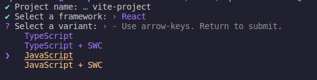

# React Documentation
 In this repository, you will be able to find my personal documentation for React.

## React
#### What is React
React is a free and open-source front-end JavaScript library for building user interfaces based on components. It is maintained by Meta and a community of individual developers and companies. React can be used to develop single-page, mobile, or server-rendered applications with frameworks like Next.js, Express, Vite and others.

React lets you build user interfaces out of individual pieces called components. Create your own React components like Thumbnail, LikeButton, and Video. Then combine them into entire screens, pages, and apps.
Whether you work on your own or with thousands of other developers, using React feels the same. It is designed to let you seamlessly combine components written by independent people, teams, and organizations.

#### Write components with code and markup
React components are JavaScript functions. Want to show some content conditionally? Use an if statement. Displaying a list? Try array map(). Learning React is learning programming.

This markup syntax is called JSX. It is a JavaScript syntax extension popularized by React. Putting JSX markup close to related rendering logic makes React components easy to create, maintain, and delete.


This is why React is more than a library, an architecture, or even an ecosystem. React is a community. It’s a place where you can ask for help, find opportunities, and meet new friends. You will meet both developers and designers, beginners and experts, researchers and artists, teachers and students. Our backgrounds may be very different, but React lets us all create user interfaces together.

## Vite
Vite is a local development server written by Evan You and used by default by Vue and for React project templates. It has support for TypeScript and JSX. Vite is a platform-agnostic frontend tool for building web applications quickly and solves some common developer headaches.

We choose this framework to work with, because is more flexible and eficient than others.

## Installation  
Use this command to install Vite and React:

    npm create vite@latest

1. In few moments we will see this:   
  
In this part we will put the name of the project, when you finish puttingthe name press intro.

2. Next you will see this:  
   
We select React and press intro again.

3. Now we see:          
   
We select JavaScript, because that is the languaje we use for the backend.

4. Finally, the project will be installed, and let you a base configs for the project, then you put the nex command ```npm i```  then the basic deppendencies for the proyect will be installed.


## Bibliography
[React](https://react.dev/)   
[Vite](https://vitejs.dev/)


## Author:
[Camilo](https://github.com/AoKuangg)